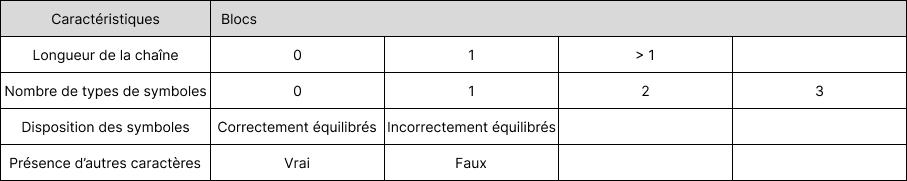

# Balanced strings

A string containing grouping symbols `{}[]()` is said to be balanced if every open symbol `{[(` has a matching closed symbol `)]}` and the substrings before, after and between each pair of symbols is also balanced. The empty string is considered as balanced.

For example: `{[][]}({})` is balanced, while `][`, `([)]`, `{`, `{(}{}` are not.

Implement the following method:

```java
public static boolean isBalanced(String str) {
    ...
}
```

`isBalanced` returns `true` if `str` is balanced according to the rules explained above. Otherwise, it returns `false`.

Use the coverage criteria studied in classes as follows:

1. Use input space partitioning to design an initial set of inputs. Explain below the characteristics and partition blocks you identified.
2. Evaluate the statement coverage of the test cases designed in the previous step. If needed, add new test cases to increase the coverage. Describe below what you did in this step.
3. If you have in your code any predicate that uses more than two boolean operators, check if the test cases written so far satisfy *Base Choice Coverage*. If needed, add new test cases. Describe below how you evaluated the logic coverage and the new test cases you added.
4. Use PIT to evaluate the test suite you have so far. Describe below the mutation score and the live mutants. Add new test cases or refactor the existing ones to achieve a high mutation score.

Write below the actions you took on each step and the results you obtained.
Use the project in [tp3-balanced-strings](../code/tp3-balanced-strings) to complete this exercise.

## Answer
1. Le domaine d'entrée prend toutes les chaînes de caractères. Nous avons cherché des caractéristiques pour séparer en block nos différentes valeurs d'entrées possibles. Tout d'abord, la chaîne de caractères peut être vide (la méthode renverra true), avoir un caractère (la méthode renverra false si le caractère est un symbole) ou avoir plusieurs caractères (le retour dépendra alors de la chaîne en elle-même). Ensuite, il peut y avoir aucun symbole dans la String, un type de symbole (que des parenthèses, que des acolades ou que des crochts), deux types ou les trois types. De plus, les symboles peuvent être équilibrés ou non. Pour finir, la châine de caractères peut présenter d'autres caractères que des symboles (par exemple des lettres) ou non. Nous avons donc le tableau suivant :


2.  Nous avons créé une entrée pour chaque combinaison d'un bloc de chaque caractéristique quand c'était possible. Par exemple le test avec la chaîne de caractère "{[)" décrit le bloc avec une string de longueur supérieure à 1, trois types de symboles, incorrectement déséquilibrés et sans présence d'autres caractères. Parfois, il n'était pas possible de cumuler des caractéristiques, comme le fait d'avoir une chaîne de caractères de taille 0, sans symbole ni autre caractère. En utilisant la fonctionnalité "Run with Coverage" de l'IDE IntelliJ, nous avons une couverture de 100% sur la méthode `isBalanced()`.

3.  Nous n'avons pas de prédicats comprenant plus de deux opérateurs booléens.

4. Nous avons un score de mutation de 14/14, tous les mutants ont été tués.

