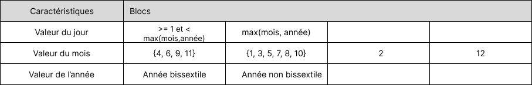

# Test the Date class

Implement a class `Date` with the interface shown below:

```java
class Date implements Comparable<Date> {

    public Date(int day, int month, int year) { ... }

    public static boolean isValidDate(int day, int month, int year) { ... }

    public static boolean isLeapYear(int year) { ... }

    public Date nextDate() { ... }

    public Date previousDate { ... }

    public int compareTo(Date other) { ... }

}
```

The constructor throws an exception if the three given integers do not form a valid date.

`isValidDate` returns `true` if the three integers form a valid year, otherwise `false`.

`isLeapYear` says if the given integer is a leap year.

`nextDate` returns a new `Date` instance representing the date of the following day.

`previousDate` returns a new `Date` instance representing the date of the previous day.

`compareTo` follows the `Comparable` convention:

* `date.compareTo(other)` returns a positive integer if `date` is posterior to `other`
* `date.compareTo(other)` returns a negative integer if `date` is anterior to `other`
* `date.compareTo(other)` returns `0` if `date` and `other` represent the same date.
* the method throws a `NullPointerException` if `other` is `null` 

Design and implement a test suite for this `Date` class.
You may use the test cases discussed in classes as a starting point. 
Also, feel free to add any extra method you may need to the `Date` class.


Use the following steps to design the test suite:

1. With the help of *Input Space Partitioning* design a set of initial test inputs for each method. Write below the characteristics and blocks you identified for each method. Specify which characteristics are common to more than one method.
2. Evaluate the statement coverage of the test cases designed in the previous step. If needed, add new test cases to increase the coverage. Describe below what you did in this step.
3. If you have in your code any predicate that uses more than two boolean operators check if the test cases written to far satisfy *Base Choice Coverage*. If needed add new test cases. Describe below how you evaluated the logic coverage and the new test cases you added.
4. Use PIT to evaluate the test suite you have so far. Describe below the mutation score and the live mutants. Add new test cases or refactor the existing ones to achieve a high mutation score.

Use the project in [tp3-date](../code/tp3-date) to complete this exercise.

## Answer
1. Nous avons considéré les formats de date du calendrier Grégorien : On commence à compter après la naissance de Jésus-Crist, il n'existe pas d'année 0, la première année est l'an 1 et l'année d'avant est l'année -1 ou 1 an avant Jésus-Crist.
Après avoir implémenté toutes les méthodes, nous avons cherché des caractéristiques et des blocs pour chaque méthode.
<p align="center">
<br>
Partitionnement pour la méthode <i>isValidDate</i>
</p>

  Pour la méthode `isLeapYear`, étant donné qu'une année bissextile peut être divisible par 4 mais pas par 100 sauf si l'année est aussi divisible par 
  400, voici le partitionnement :

<p align="center">
<br>
Partitionnement pour la méthode <i>isLeapYear</i>
</p>

  Bien que les méthodes `nextDate` et `previousDate` ne prennent pas de paramètres d'entrées, elles agissent sur un objet Date, composé d'un jour, d'un 
  mois et d'une année. Cependant, une date ne peut pas avoir de format invalide (car le constructeur renvoie une exception dans ce cas).

<p align="center">
<br>
Partitionnement pour la méthode <i>nextDate</i>
</p>
<p align="center">
<br>
Partitionnement pour la méthode <i>previousDate</i>
</p>

  Le partitionnement des deux méthodes précédentes se ressemblent énormément mais `nextDate` met l'accent sur le cas de la fin d'un mois ou d'une année 
  tandis que `previousDate` s'intéresse au cas du début d'un mois ou d'une année. 
  Pour la méthode `compareTo` nos caractéristiques tiennent sur l'objet en paramètre mais dépendent aussi de this. 

</p>
<p align="center">
<br>
Partitionnement pour la méthode <i>compareTo</i>
</p>

  Nous remarquons que toutes les méthodes excexpté `isLeapYear` partagent les mêmes caractéristiques, avec des blocs plus ou moins différents. En 
  effet, toutes ces méthodes utilisent des objets Date et manipulent les mêmes attributs. 

3. Nos tests satisfont le `Base Choice Coverage`. En effet, nous pouvons prendre l'exemple des tests pour la méthode `isValidDate` : Nous sommes partis de l'exemple {day: 1, month: 1, year: 0} pour tester quand l'année est mauvaise, puis nous avons modifié le mois en le mettant à -1 pour le cas où le mois et l'année ne sont pas valides. Ensuite, nous avons modifié la valeur du jour. Nous avons donc petit à petit modifier chaque paramètre en gardant l'année à 0. De cette façon, nous avons pu tester efficacement la condition `if( badYear || badMonth || badYear)`.
Nous avons réalisé la même technique pour la méthode `isLeapYear`, nous prenions une année divisible par 4 mais ni par 100, ni par 400, ensuite nous avons pris une année divisible par 4 et 100 mais pas par 400 etc.

4. Après avoir lancé PIT, nous avons un score de mutation de 88% avec 82 mutants tués sur 93. Ce score peut être améliorable. Pour cela, nous regardons les mutants qui ont survécu pour essayer de trouver les cas de tests à rajouter. Nous avons vu par exemple que nous ne testions pas pour la méthode `nextDate` le cas où la date est la fin d'un mois de trente jours. En rajoutant ce test, nous sommes passés à un score de mutation de 91% avec 85 mutants tués sur 93. Nous avons également vu que nous n'avions aucun test pour la méthode `compareTo` tel que le mois et l'année était identique. En le rajoutant, nous avons tués deux mutants de plus et somme passés à un score de 94%. En ajoutant de nouveaux tests, nous sommes arrivés à un score de 96%.
